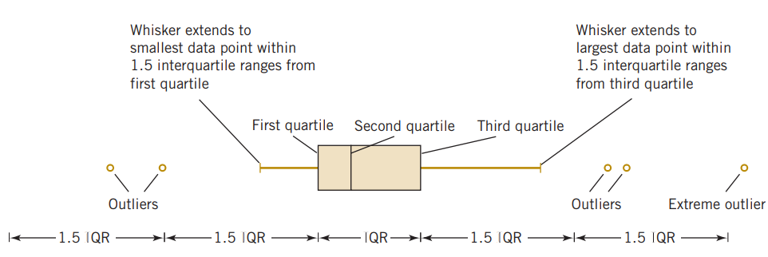

# Introduction to Statistics

The field of **statistics** deals with the collection, presentation, analysis, and use of data to make decisions, solve problems, and design products and processes. In simple terms, **statistics is the science of data**.

Because many aspects of engineering practice involve working with data, obviously knowledge of statistics is just as important to an engineer as are the other engineering sciences.

Specifically, statistical techniques can be powerful aids in designing new products and systems, improving existing designs, and designing, developing, and improving production processes.

Statistical methods are used to help us describe and understand **variability**. By variability, we mean that successive observations of a system or phenomenon do not produce the same result. We all encounter variability in our everyday lives, and **statistical thinking** can give us a useful way to incorporate this variability into our decision-making processes [@montgomery2014].

## Types of Data

- **Quantitative**: Data that represents numerical values.

  **Example**: Heights of people, temperatures, test scores.

  Subtypes:

  - **Discrete Data**: Countable values (e.g., number of students in a class).

  - **Continuous Data**: Measurable values that can take any value within a range (e.g., weight, time).

- **Categorical:** Data that represents categories or labels.

  **Example:** Colors of cars, types of animals, survey responses (e.g., yes/no).

  Subtypes:

  - **Nominal Data**: Categories without a natural order (e.g., gender, blood type).

  - **Ordinal Data**: Categories with a meaningful order (e.g., rankings, education levels).

## Source of data

When the data are all of the observations in the population. This results in a **census**. However, in the engineering environment, the data are almost always a **sample** that has been selected from the population. Three basic methods of collecting data are

\(i\) A **retrospective study** using historical data (ii) An **observational study** (iii)A **designed experiment**

An effective data-collection procedure can greatly simplify the analysis and lead to improved understanding of the population or process that is being studied. We now consider some examples of these data-collection methods. (For detail, *see* @montgomery2014 **, Chapter 1**)

## Population and Sample

- **Population:** A **population** is the entire collection of elements or outcomes about which information is required.

The total number of elements in the population is called the **population size**, denoted by $N$.

- **Sample:** A **sample** is a subset of a population, comprising the elements or outcomes that are actually observed. A good sample must be *representative* of its population.

The number of elements in the sample is called the **sample size**, denoted by $n$.

- A numerical summary of a sample is called a **statistic**.

- A numerical summary of a population is called a **parameter**.

- **Statistics** are often used to *estimate* **parameters**.\

## Random Sample

A simple random sample of size $n$ is a sample chosen by a method in which each collection of $n$ elements selected from population is equally likely to contain the sample, just as in a lottery.

## Branch of Statistics: Descriptive and Inferential Statistics

The study of statistics is divided into two parts- **Descriptive statistics** and **Inferential statistics**.

**Descriptive statistics** is the branch of statistics that involves the organization, summarization, and display of data.

\
**Inferential statistics** is the branch of statistics that involves using a sample to draw conclusions about a population.

A basic tool in the study of inferential statistics is **probability** and **probability distribution**s.

The goal of inferential statistics is to draw conclusions from a sample and generalize them to the population. The most common methodologies used are hypothesis tests, Analysis of variance, etc.\
\
We will begin with **descriptive statistics.**

## Descriptive Statistics

### Measures of Central Tendency

Central tendency refers to a most typical or most representative or central value of a data set. It summarize a data numerically with a single measure. The most common **measures of central tendency** are the **mean( arithmetic average)**, **median** and **mode**.

#### The mean

Consider a sample data of size $n$ of variable $X$ with observations $x_1,x_2,...,x_n$. Then the mean/ sample mean of $X$ is:

$$\bar X=\frac{x_1+x_2+...+x_n}{n}=\frac{\sum x}{n}$$ {#eq-sample_mean}

On the other hand if we have population data of size $N$ then the population mean of $X$ is:

$$\mu =\frac{\sum_{i=1}^N x_i }{N}$$ {#eq-pop_mean}

**Example:**

**Note:**

- Sum of the deviation form mean is zero that is $\sum_{i=1}^n (x_i-\bar x)=0$.

- For any real number $a \ne \bar x$, $\sum_{i=1}^n(x_i-\bar x)^2< \sum_{i=1}^n(x_i-a)^2$.

- Mean is affected by outlier/extreme value.

#### The median

#### The mode

### The quantiles (Percentiles, quartiles, deciles)

The quantiiles are cut points which divide a data set into particular equal portions. For example:

- Percentiles divides the data into approximately 100 equal parts.

- Quartiles divides the data into approximately 4 equal parts.

- Deciles divides the data into approximately 10 equal parts.

Quartiles and Deciles are special case of Percentiles.

**Formula to compute Percentiles**

The $j^{th}$ percentile is computed as follows:

$$P_j=\left ( \frac{n+1}{100}*j \right)^{th} value \ \ ; \ \ j=1,2,...,99$$ {#eq-percentile}

**Note that**

- First/lower quartile, $Q_1=P_{25}$.

- Second quartile/median, $Q_2=P_{50}$.

- Third/upper quartile, $Q_3=P_{75}$.

**Problem** Compute the 25^th^ and 60^th^ percentile from the following data:

CPU time of 9 jobs (in seconds): 59, 46, 37, 42, 30, 55, 56, 36, and 82.

[*Solution:*]{.underline} Here, $n=9$.

**Sorted data:** 30, 36, 37, 42, 46, 55, 56, 59, and 82.

So, $P_{25}=(25*\frac{9+1}{100})^{th} \ \ value=2.5^{th} \ \ value$

$=2^{nd} \ \ value +0.5(3^{rd}-2^{nd})=36+0.5(37-36)=36.5$.

[Interpretation:]{.underline} $P_{25}=36.5$ implies that approximately 25% of the total observations lie below or equal to 36.5.

Similarly, $P_{60}=(60*\frac{9+1}{100})^{th}\ \ value=6^{th}\ \ value=55$.

[Interpretation:]{.underline} $P_{60}=55$ implies that approximately 60% of the total observations lie below or equal to 55.

**Problem :** Here is the monthly starting salary (\$) of 12 graduates:

3450, 3550, 3650, 3480, 3355, 3310, 3490, 3730, 3540, 3925, 3520, 3480

**Compute** Q1 and Q3 of the above data (*Will be solved in class*).

### Measures of Variation

Variability in data means lack of uniformity. It is also referred to as spread, scatter, or dispersion. We turn now to a discussion of some commonly used measures of variability.

#### Range

Range, $R=Maximum \ \ value- Minimum \ \ value$

- Heavily influenced by extreme values

#### Inter-quartile-range

Inter-quartile-range, $IQR=Q_3-Q_1$

- It exhibits the variability in the middle 50% of the observations.

- The interquartile range is less sensitive to the extreme values in the sample than is the ordinary sample range.

#### Variance and Standard deviation

- Sample variance (denoted by English Letter $s^2$),

  $$s^2=\frac{(x_1-\bar x)^2+(x_2-\bar x)^2+...+(x_n-\bar x)^2}{n-1}=\frac{\sum(x_i-\bar x)^2}{n-1}$$

  $$\therefore\ \  s^2 =\frac{\sum x_i^2-n(\bar x)^2}{n-1}$$ {#eq-sampl_var}

  and Sample SD,

  $$s=\sqrt {s^2}$$

- Population variance (denoted by Greek Letter $\sigma ^2$),

$$\sigma^2=\frac{(x_1-\mu)^2+(x_2-\mu)^2+...+(x_N-\mu)^2}{N}=\frac{\sum(x_i-\mu)^2}{N}=\frac{\sum x_i^2-N(\mu)^2}{N}$$

$$\therefore \ \ \sigma^2=\frac{\sum x^2}{N}-\mu^2$$ {#eq-pop_var}

and Population SD is

$$\sigma =\sqrt {\sigma^2}$$

**Note:** In modern statistics and quality management, **consistency is the hallmark of quality.** While the **Mean** tells you if you are hitting your target, the **Variation (Standard Deviation)** tells you how reliable you are. High variation is often referred to as the "enemy" of quality because it creates unpredictability.

**Problem :** Ten-count tests made on certain yarn have shown following results.

22.8, 23.2, 22.9, 22.6, 23.4, 23.0, 23.1, 23.0, 22.9, 23.0

Compute sample mean, sample variance and sample standard deviation.

[*Solution:*]{.underline} Suppose $X$ be the count test.

```{r}
yarn_cnt=c(22.8, 23.2, 22.9, 22.6, 23.4, 23.0, 
           23.1, 23.0, 22.9, 23.0  )
#length(yarn_cnt)
#sum(yarn_cnt)
#sum(yarn_cnt^2)
#mean(yarn_cnt)
#var(yarn_cnt)
```

Here, $n=10$; $\sum x =229.9$ ,

$\sum x^2=x_1^2+x_2^2+...+x_n^2=22.8^2+23.2^2+...+23.0^2=5285.83$

So, the **sample mean** $\bar x=\frac{\sum x}{n}=\frac{229.9}{10}=22.99$ .

**Sample variance**, $s^2=\frac{\sum x^2-n\cdot (\bar x ^2)}{n-1}=\frac{5285.83-10\cdot (22.99^2)}{10-1}=0.04766667$ and

**Sample SD,** $s=\sqrt  {s^2}=\sqrt {0.04766667}=0.218327\approx0.2183$.

#### Coefficient of variation

$$CV=\frac{SD}{Mean}$$ {#eq-cv}

- CV is unit free.

- A lower CV indicates that the variation is small compared to the size of the mean, which refers **greater consistency** or **reliability.**

- In general industry Standards for "Good Consistency", **CV should be less than 10%** and $CV\ge 30\%$ indicates "Poor consistency" [@vanBelle2002] .

Problem: **Compute** coefficient of variation of yarn-count data mentioned in Problem.....

**Problem** Five strength tests each carried out on the two fabrics have shown following results:

**A:** 15.2, 15.5, 15.0, 15.4, 15.6

**B:** 15.0, 14.8, 13.6, 15.5, 15.2

**Find** CV% for both and **decide** which fabric is more consistent.

[*Solution:*]{.underline}

**Problem** Following data represents number of end breaks recorded on two ring frames at ten occasions.

**R/F-I:** 12, 10, 8, 15, 9, 11, 14, 15, 8, 10

**R/F-II:** 10, 11, 12, 9, 12, 9, 11, 12, 11, 10

**Find** which ring frame is more consistent in terms of end breaks.

[*Solution:*]{.underline}

::: {.callout-note appearance="simple"}
## Exercise 1.1

**1)** An article describes an experiment to test the yield strength of circular tubes with caps welded to the ends. The first 8 yields (in kN) are: 104, 108, 126,126, 128, 128, 140, 156

**Compute** the sample mean, the standard deviation, and the coefficient of variation of the yield strength.

**2)** The “cold start ignition time” of an automobile engine is being investigated by a gasoline manufacturer. The following times (in seconds) were obtained for a test vehicle: 1.75, 1.92, 2.62, 2.35, 3.09, 3.15, 2.53, 1.91.

**Calculate** the sample mean, sample standard deviation and coefficient of variation of cold start ignition time.

**3)** The monthly starting salary (\$) of 12 graduates are as follows:

3450 ,3550 ,3650 ,3480 ,3355, 3310 ,3490 ,3730, 3540 ,3925, 3520 ,3480

(i) **Compute** mean, median, lower and upper quartiles of salary data. Also compute IQR and standard deviation

(ii) To be in top 15% earners what should be the starting salary of a graduate?

**4)** The lengths of power failures, in minutes, are recorded as follows: 18, 15, 90, 78, 69, 98, 102, 83, 55, 28.

(i) **Compute** sample mean and standard deviation.\
(ii) **Compute** sample median and IQR.\
(iii) To be in the bottom 10% of power failures in your residence then what should be the cutoff value of power failure lengths?

**5)** Following are the results of count tests made on the production of two shifts:

**Shift I:** 11.7, 12.2, 12.0, 11.6, 10.9, 13.0, 11.0, 12.8, 11.5, 12.0

**Shift II:** 12.2, 11.6, 12.0, 12.1, 12.0, 12.3, 11.8, 11.6, 11.8, 12.0

Using CV% **decide** which production is more consistent.\
\
\
:::

## Data visualization

Before diving into advanced analysis we should have a look at the data. Because ” A picture is worth a thousand words”. Often a summary of a collection of data via a graphical display can provide insight regarding the system from which the data were taken.

### Data viz. for Qualitative/categorical data

- **Bar-chart**- used to visualise frequency of each label of categorical variable with 2D bar.

- **Pie-chart**- used to visualise frequency/ percentage of each label of categorical variable in a circle.

- **Stacked/Clustered Bar chart**- used to show the relation between two categorical variables in side-by-side column/ stacked-column.

For detail, visit [Summarizing Categorical Data](https://saif525.quarto.pub/statistics-for-business-and-economics/2descriptive_graph_tab.html).

### Data viz. for Quantitative data:

- Histogram

- Boxplot

- Scatter plot

#### Histogram

The **histogram** is a visual display of the frequency distribution. **The histogram** provides a visual impression of the **shape** of the distribution of the measurements and information about the **central tendency** and scatter or **dispersion** in the data.

To construct a frequency distribution, we must divide the range of the data into intervals, which are usually called **class intervals, cells**, or **bins (number of classes ) ,** and count how many observations fall into each **bin**.

- A **frequency histogram** consists of columns, one for each **bin**, whose height is determined by the **number** of observations in the **bin**. \[Frequency distribution\]

- A **relative frequency histogram** has the same shape but a different vertical scale. Its column heights represent the **proportion** of all data that appeared in each bin. \[Relative frequency distribution\]

**Example 1.10:** The following data are the joint temperatures of the O-rings (°F) for each test firing or actual launch of the space shuttle rocket motor (from *Presidential Commission on the Space Shuttle Challenger Accident*, Vol. 1, pp. 129–131):

> 67, 40, 58, 76, 58, 70, 72, 67, 75, 70, 57, 83, 53, 45, 70, 81, 78, 76, 67, 73, 61, 52, 31, 67, 79, 75, 69, 84, 68, 80

**To construct frequency distribution and others follow the steps:**

**Step-1:** Find the **number bins**, $k=\sqrt n=\sqrt 30=5.48\approx 6$ (round to nearest integer).

**Step-2:** Find the range of the data, $R=Maximum-Minimum=84-31=53$

**Step-3:** Determine **bin width**, $w=\frac{R}{k}=\frac{53}{6}=8.83 \approx 10$

**Step-4:** Define the **bins** in ***exclusive*** method, starting from a suitable data value close to lowest value, for example **\[30, 40), \[40, 50), and so on** until we have the highest data value.

**Step-5:** Now count the observation fall in each bin, using tally.

+--------------+------------------------------+---------------+-------------------------+---------------------------+
| Temperatures | Tally                        | Frequency (f) | Relative frequency (rf) | Cumulative frequency (cf) |
|              |                              |               |                         |                           |
| (in ^o^ F)   |                              |               |                         |                           |
+:============:+:============================:+:=============:+:=======================:+:=========================:+
| \[30,40)     | \|                           | 1             | 0.03                    | 1                         |
+--------------+------------------------------+---------------+-------------------------+---------------------------+
| \[40,50)     | \|\|                         | 2             | 0.07                    | 3                         |
+--------------+------------------------------+---------------+-------------------------+---------------------------+
| \[50,60)     | ~~\|\|\|\|~~                 | 5             | 0.17                    | 8                         |
+--------------+------------------------------+---------------+-------------------------+---------------------------+
| \[60,70)     | ~~\|\|\|\|~~ \|\|            | 7             | 0.23                    | 15                        |
+--------------+------------------------------+---------------+-------------------------+---------------------------+
| \[70,80)     | ~~\|\|\|\|~~ ~~\|\|\|\|~~ \| | 11            | 0.37                    | 26                        |
+--------------+------------------------------+---------------+-------------------------+---------------------------+
| \[80,90)     | \|\|\|\|                     | 4             | 0.13                    | 30                        |
+--------------+------------------------------+---------------+-------------------------+---------------------------+
| **Total**    |                              | n=30          | 1.00                    |                           |
+--------------+------------------------------+---------------+-------------------------+---------------------------+

: Frequency, Relative frequency, Cumulative frequency Distribution for the O-rings temperature data (n=30)

The histogram from the previous example is shown in @fig-fig21:

```{r}
#| label: fig-fig21
#| fig-cap: "Frequency histogram of temperature (°F)"

fd.data<-c(67, 40, 58, 76, 58, 70, 72, 67, 75, 70, 57, 83, 53, 45, 70, 81, 78, 76, 67, 73, 61, 52, 31, 67, 79, 75, 69, 84, 68, 80)

#summary(fd.data)

hist(fd.data,main = "",
     xlab = "Temperature  (°F)",
     labels = TRUE,ylim=c(0,12), right = FALSE,col = "#a2d2ff")

```

**Histogram and shape of the distribution**

Departure from symmetry is often referred as **skewness.** When the sample size is large, the histogram can provide a reasonably reliable indicator of the general **shape** of the distribution or population of measurements from which the sample was drawn. Here are some typical examples of **skewness.**

```{r}
#| label: fig-hist.skewness
#| fig-cap: "Histograms Showing Differing Levels of Skewness"

# Load required libraries
library(ggplot2)
library(dplyr)

set.seed(123)

# Generate data with different skewness
df <- data.frame(
  value = c(
    rbeta(500, 2, 5),    # Moderately right skewed
    rbeta(500, 5, 2),    # Moderately left skewed
    rnorm(500, 0.5, .2),# Symmetric
    rbeta(500, 1, 5)     # Highly right skewed
  ),
  panel = factor(rep(c("B: Moderately Skewed Right",
                       "A: Moderately Skewed Left",
                       "C: Symmetric",
                       "D: Highly Skewed Right"),
                     each = 500),
                 levels = c("A: Moderately Skewed Left",
                            "B: Moderately Skewed Right",
                            "C: Symmetric",
                            "D: Highly Skewed Right"))
)

# Plot
ggplot(df, aes(x = value)) +
  geom_histogram(aes(y = after_stat(density)), bins = 10, fill = "#58A0C8", color = "black") +
  facet_wrap(~panel, ncol = 2) +
  labs(
    title = " ",
    y = NULL,
    x = NULL
  ) +
  theme_minimal(base_size = 13) +
  theme(
    strip.text = element_text(face = "bold"),
    plot.title = element_text(face = "bold", hjust = 0.5),
    panel.grid.minor = element_blank()
  )
```

**NOTE:** A **symmetric histogram** often represents a stable, predictable process where data clusters evenly around the mean, indicating that variation is likely due to common causes rather than specific errors.

#### Box-plot

The **box plot** is a graphical presentation that simultaneously describes several important features of a data set, such as **center**, **spread**, **departure from symmetry**, and identification of unusual observations or **outliers**.

To construct a box-plot we have

- to sort data (smallest to largest

- to compute $Q_1, Q_2,Q_3, IQR$

- to determine the **lower fence**, $lf=Q_1-1.5(IQR)$

- to determine the **upper fence,** $uf=Q_3+1.5(IQR)$

Then we draw a diagram like the following which is called a box plot [@montgomery2014, 239].

{#fig-boxplt fig-alt="(Montgomery and Runger 2014, 239) " fig-align="center"}

**Illustration with an example**

The data provides a the fuel consumption in Gallons per Kilometer (GpK) for a group of 17 medium-sized mobile home units.

30, 34, 34, 34, 34, 35, 35, 35, 35, 35, 35, 37, 37, 38, 40, 42, 42

\(a\) **Construct** a box-plot.

\(b\) **Comment** about shape of the data (departure from symmetry)

\(c\) **Show** outlier (if any).

[Solution:]{.underline}

```{r}
#| label: fig-box
#| fig-cap: " Box-plot of fuel consumption (in GpK)"

box=c(30, 34, 34, 34, 34, 35, 35, 35, 35, 35, 35, 37, 37, 38, 40, 42, 42)
boxplot(box,horizontal=TRUE,main="(a) Box-plot")
```

\(b\) Approximately symmetric.

\(c\) There is an outlier in the upper tail (42).

**Parallel/comparative box-plot**

Box plots are very useful in graphical comparisons among data sets because they have high visual impact and are easy to understand.\

**Example:** Two catalysts are being analyzed to determine how they affect the mean yield of a chemical process. Specifically, catalyst 1 is currently used; but catalyst 2 is acceptable. Because catalyst 2 is cheaper, it should be adopted, if it does not change the process yield. A test is run in the pilot plant and results in the data shown below [@montgomery2014, page 384].

+--------------------+-------+-------+-------+-------+-------+-------+-------+-------+
| Observation Number | 1     | 2     | 3     | 4     | 5     | 6     | 7     | 8     |
+:===================+:=====:+:=====:+:=====:+:=====:+:=====:+:=====:+:=====:+:=====:+
| **Catalyst 1**     | 91.50 | 94.18 | 92.18 | 95.39 | 91.79 | 89.07 | 94.72 | 89.21 |
+--------------------+-------+-------+-------+-------+-------+-------+-------+-------+
| **Catalyst 2**     | 89.19 | 90.95 | 90.46 | 93.21 | 97.19 | 97.04 | 91.07 | 92.75 |
+--------------------+-------+-------+-------+-------+-------+-------+-------+-------+

: Performance Values for Catalyst 1 and Catalyst 2

@fig-comp_box presents a comparative box plot of the data from the two samples.

```{r}
#| label: fig-comp_box
#| fig-cap: "Comparison of Catalyst Performance: Catalyst 1 vs. Catalyst 2"
#| fig-width: 4
#| fig-height: 5

# Create the Catalyst Data Frame
catalyst_data <- data.frame(
  Catalyst_1 = c(91.50, 94.18, 92.18, 95.39, 91.79, 89.07, 94.72, 89.21),
  Catalyst_2 = c(89.19, 90.95, 90.46, 93.21, 97.19, 97.04, 91.07, 92.75)
)

# View the data frame
#print(catalyst_data)

# Create the parallel boxplot
boxplot(catalyst_data,
        names = c("Catalyst 1", "Catalyst 2"),
        #main = "Comparison of Catalyst Performance",
        ylab = "Yield",
        col = c("lightyellow", "lightyellow"),
        border = "darkblue")

```

Though the **median** yields are same for both catalysts but Catalyst 2 produces higher variability in yield. However overall maximum yield is obtained from Catalyst 2. So based on this visual inspection we can use Catalyst 2 (it is also cheaper!).

**NOTE:** To know more about box-plot please visit [Minitab® Support](https://support.minitab.com/en-us/minitab/help-and-how-to/graphs/boxplot/interpret-the-results/key-results).

## Exercise 1.2

1\) The following sample data presents the thickness (Å) of a metal layer on 20 silicon wafers resulting from a chemical vapor deposition (CVD) process. Scientists believe that the thickness is usually normally distributed having a bell-shaped distribution for a smooth process. **Construct** a frequency histogram of metal thickness data. **Conclude** whether the process is smooth or not.

> 468, 459, 450, 453, 473, 454, 458, 438, 447, 463,
>
> 445, 466, 456, 434, 471, 437, 459, 445, 454, 423

2\) The shear strengths of 20 spot welds in a titanium alloy are as follows:

> 5408 5431 5475 5442 5376 5388 5459 5422 5416 5435
>
> 5420 5429 5401 5446 5487 5416 5382 5357 5388 5457

**Construct** a frequency histogram of shear strength data. **Conclude** whether the shear strength is approximately symmetric or not.

3\) The data provides the fuel consumption for a group of 17 medium-sized mobile home units.

30, 34, 34, 34, 34, 35, 35, 35, 35, 35, 35, 37, 37, 38, 40, 42, 42.

i)  **Construct** a boxplot and show outlier(s) if any. Does the plot appear to be symmetric?

ii) **Find** the 90^th^ percentile. Is it an outlier?

4\) The cylindrical compressive strength (in MPa) was measured for 11 beams. The results were:

> 38.43, 38.43, 38.39, 38.83, 38.45, 38.35, 38.43, 38.31, 38.32, 38.48, 38.50.

i)  **Compute** 1st quartile, 3rd quartile and IQR.

ii) **Check** for outlier (s).

iii) **Construct** a box-plot, **show** the outliers and **comment** about the symmetry of the distribution.

5\) An article describes an experiment to test the yield strength of circular tubes with caps welded to the ends. The first 18 yields (in kN) are:

> 96, 96, 102, 102, 102, 104, 104, 108, 126,126, 128, 128, 140, 156, 160, 160, 164,170.

**Construct** a simple box-plot of yield strength. **Find** the value above which top 10% yield strength lie.

6\) The data are diameters (in mm) of holes in a group of 12 wing leading edge ribs for a commercial transport airplane:

120.1, 120.2, 120.3, 120.4, 120.5, 120.5, 120.7, 120.8, 120.9, 120.9, 121.3, 121.1

**Construct** a box-plot and show outlier(s) if any. Comment about departure from symmetry of diameter of holes data.

7\) **The Number of Breaks in Yarn during Weaving** [@Tippett1950]

This data set gives the number of warp breaks per loom, where a loom corresponds to a fixed length of yarn.

**Format**

A data frame with 54 observations on 3 variables.

|           |         |                                |
|:----------|:--------|:-------------------------------|
| `breaks`  | numeric | The number of breaks           |
| `wool`    | factor  | The type of wool (A or B)      |
| `tension` | factor  | The level of tension (L, M, H) |

There are measurements on 9 looms for each of the six types of warp (`AL`, `AM`, `AH`, `BL`, `BM`, `BH`). A comparative boxplot is shown in @fig-breaks.

a\) **Describe** which wool is better.

b\) **Describe** which tension is better.

```{r}
#| label: fig-breaks
par(mfrow=c(1,2))
boxplot(breaks~wool, data=warpbreaks)
boxplot(breaks~tension, data=warpbreaks)

```
