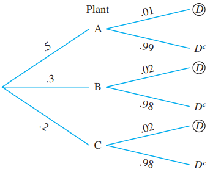

# Probability and Random Variables

Our life is full of uncertainty. To take valid decision in the face of uncertainty we have to study **probability**. For examples we often think of the following phenomenon:

- What is the chance that a newly bought smartphone malfunction before the warranty period?

- What is the probability that 2 or more defective items in found in a lot?

- How likely that no customer arrives in next five-minute period in a superstore? etc.

## Basic elements of probability

- **Random experiment:** Which has 2 or more outcomes and cannot be predicted with certainty. **Example:** Tossing a coin, rolling a dice, testing the strength of fibers etc.

- **Sample space:** The set of all possible outcomes of a random experiment, often denoted by Greek uppercase letter Omega ($\Omega$). **Example** The sample space of rolling a six-sided dice is: $\Omega =\{1,2,3,4,5,6 \}$.

- **Event:** An event ($A$) is a subset of the sample space $(A\subseteq \Omega)$.

- **Complement event:** The complement of an event $A$ consists of all the outcomes in the sample space $\Omega$ that are not in $A$, often denoted by $A^c, A^{'}$ or $\bar A$. In set theory, $A^{'}=\Omega-A$.

- **Mutually exclusive/disjoint events:** A sequence of events $A_1, A_2, A_3,...$ are said to be mutually exclusive events if they cannot happen together.

Mathematically, $$A_i \cap A_j = \emptyset \quad \text{for } i \neq j$$

- **Mutually exhaustive events:** In probability, a set of events is called collectively exhaustive if their union covers the entire sample space. In other words, at least one of these events must happen whenever the experiment is performed. If $E_1, E_2, E_3, \dots, E_n$ are events in a sample space $\Omega$, they are exhaustive if:

$$E_1\cup E_2\cup E_3=\Omega $$

## Probability Measure

A probability measure$(P)$ is a function that assigns a probability to each event defined in $\Omega$ satisfies the following axioms:

(i) $0\le P(A)\le1$
(ii) For any countable sequence of disjoint events $A_1, A_2, A_3,...$,

$$P(A_1\cup A_2 \cup A_3\cup ...)=P(A_1)+P(A_2)+P(A_3)+...$$

(iii) $P(\Omega)=1$

## Discrete Uniform law of probability

If an experiment can result in any one of $N$ different equally likely outcomes, and if exactly $n$ of these outcomes correspond to event $A$, then the probability of event $A$ is

$$P(A)=\frac{n}{N}$$

For example, if a box contain 5 defective and 15 non-defective items, then in a random draw the probability of selecting a defective item ($D$) is

$$P(D)=\frac{5}{20}=0.25$$

## Rules of Probablity (Two events)

+-------------+-----------------------------------+----------------------------------------------------------------+
| Event       | Rule                              | Explanation                                                    |
+=============+===================================+================================================================+
| $A'$        | $P(A')=1-P(A)$                    | $A$ does NOT happen(Complement rule)                           |
+-------------+-----------------------------------+----------------------------------------------------------------+
| $A\cap B'$  | $P(A\cap B')=P(A)-P(A\cap B)$     | Only $A$ happens/ $A$ happens BUT NOT $B$ /Eaxctly $A$ happens |
+-------------+-----------------------------------+----------------------------------------------------------------+
| $A\cup B$   | $P(A\cup B)=P(A)+P(B)-P(A\cap B)$ | Either $A$ or $B$ or both/ at least one                        |
+-------------+-----------------------------------+----------------------------------------------------------------+
| $A'\cap B'$ | $P(A'\cap B')=P(A\cup B)'$        | Neither $A$ nor $B$ happens                                    |
|             |                                   |                                                                |
|             | $=1-P(A\cup B)$                   |                                                                |
+-------------+-----------------------------------+----------------------------------------------------------------+

**Example: (DC Mont.)** If $P(A) = 0.3$, $P(B) = 0.2$, and $P(A \cap B) = 0.1$, determine the following probabilities:

a.  $P(A')$
b.  $P(A \cup B)$
c.  $P(A' \cap B)$
d.  $P(A \cap B')$
e.  $P(A \cup B)'$
f.  $P(A' \cup B)$
g.  $P(A'\cap B')$

**Problem 2.1: (W Navidi)** A system contains two components, A and B. The system will function so long as either A or B functions. The probability that A functions is 0.95, the probability that B functions is 0.90, and the probability that both function is 0.88. What is the probability that the system functions?

**Problem 2.2: (W Navidi)** Let S be the event that a randomly selected college student has taken a statistics course, and let C be the event that the same student has taken a chemistry course. Suppose P(S) = 0.4, P(C) = 0.3, and $P(S \cap C) = 0.2$.

a.  Find the probability that a student has taken statistics, chemistry, or both.

b.  Find the probability that a student has taken neither statistics nor chemistry.

c.  Find the probability that a student has taken statistics but not chemistry.

**Problem 2.3: (W Navidi)** Let V be the event that a computer contains a virus, and let W be the event that a computer contains a worm. Suppose $P(V) = 0.15$, $P(W) = 0.05$, and $P(V \cup W) = 0.17$.

a.  Find the probability that the computer contains both a virus and a worm.

b.  Find the probability that the computer contains neither a virus nor a worm.

c.  Find the probability that the computer contains a virus but not a worm.

**Problem 2.4: (W Navidi)** Inspector A visually inspected 1000 ceramic bowls for surface flaws and found flaws in 37 of them. Inspector B inspected the same bowls and found flaws in 43 of them. A total of 948 bowls were found to be flawless by both inspectors. One of the 1000 bowls is selected at random.

a.  Find the probability that a flaw was found in this bowl by at least one of the two inspectors.

b.  Find the probability that flaws were found in this bowl by both inspectors.

c.  Find the probability that a flaw was found by inspector A but not by inspector B.

## Conditional Probability, Multiplication rule and Independence

If $A$ is a prior event (happens first) and $B$ is another event happens after $A$ then the **conditional probability of** $B$ given $A$ is defined as:

$$P(B|A)=\frac{P(A\cap B)}{P(A)}\ \ ;\ \  P(B)>0$$

It implies that,

$$P(A\cap B)=P(A)\cdot P(B|A) \ \ \ \ \mathrm {[\textbf{Multiplication rule}]}$$

**Note:** Use of these rules depends on the situation (on given information).

**Problem 2.5(Walpole)** The probability that an automobile being filled with gasoline also needs an oil change is 0.25; the probability that it needs a new oil filter is 0.40; and the probability that both the oil and the filter need changing is 0.14.

a.  If the oil has to be changed, what is the probability that a new oil filter is needed?

b.  If a new oil filter is needed, what is the probability that the oil has to be changed?

::: {.callout-note appearance="minimal"}
## Independence

If $A_1$ and $A_2$ are independent then,

$$P(A_1\cap A_2)=P(A_1)\cdot P(A_2)$$

For multiple independent events say $A_1,A_2,...,A_k$,

$$P(A_1\cap A_2\cap...\cap A_k)=P(A_1)\cdot P(A_2)\cdot \cdot \cdot P(A_k) $$

**Corrolary:** If $A_1$ and $A_2$ are independent then,

$$P(A_1'\cap A_2')=P(A_1')\cdot P(A_2')$$

**Problem 2.6(DC Mont.):** The probability that a lab specimen contains high levels of contamination is 0.10. Three samples are checked, and the samples are independent.

a.  What is the probability that none contain high levels of contamination?

b.  What is the probability that exactly one contains high levels of contamination?

c.  What is the probability that at least one contains high levels of contamination?

**Problem 2.7(Walpole) :** A town has two fire engines operating independently. The probability that a specific engine is available when needed is 0.96.

a.  What is the probability that neither is available when needed?

b.  What is the probability that a fire engine is available when needed?
:::

## Probability Tree, Total Probability Rule and Bayes' Rule

Given,

| Prior probability | Conditional probability |
|:-----------------:|:-----------------------:|
|     P(A)=0.5      |      P(D\|A)=0.01       |
|     P(B)=0.3      |      P(D\|B)=0.02       |
|     P(C)=0.2      |      P(D\|C)=0.02       |

These probabilities can be presented in following tree diagram:

{width="397" height="260"}

**Total probability rule:**

$P(D)=P(D\cap A)+P(D\cap B)+P(D\cap C)$

Or, $P(D)=P(A)\cdot P(D|A)+P(B)\cdot P(D|B)+P(C)\cdot P(D|C)$

Or, $P(D)=(0.5)(0.01)+(0.3)(0.02)+(0.2)(0.02)=0.015$

We can also compute $P(A|D)$ as follows:

$$P(A|D)=\frac{P(A\cap D}{P(D)}=\frac{(0.5)(0.01)}{0.015}=0.3333\approx 33.33\%$$

**This is known as Bayes' Theorem or rule**

**Problem 2.8:** The panels for the Pulsar 32-inch widescreen LCD HDTVs are manufactured in three locations and then shipped to the main plant of Vista Vision for final assembly. Plants A, B, and C supply 50%, 30%, and 20%, respectively, of the panels used by the company. The quality-control department of the company has determined that 1% of the panels produced by plant A are defective, whereas 2% of the panels produced by plants B and C are defective.

a\) What is the probability that a randomly selected Pulsar 32-inch HDTV will have a defective panel? (**Ans:** 0.015)

b\) If the selected Pulsar 32-inch HDTV is found defective, what is the probability that the component selected was produced by Plant C? (**Ans:** 26.67%)

## Random Variables

A **variable** is said to be **random** if its values are determined by a random experiment. In other word, **random variable** is a numerical description of the outcome of an experiment.

- A random variable often denoted with an uppercase letter (say $X$)

- The value of a random variable is denoted with a lowercase letter (say $x$)

**Illustration** Consider a random experiment of tossing a coin (fair/unfair) 2 times. Then the sample space is

$$S=\{ HH,HT,TH,TT \}$$

Now let, $X= number\ \  of\ \  heads \ \ occur$

From the sample space we can see that $X$ can take following values:

|                  |     |
|:----------------:|:---:|
| **Sample point** | $x$ |
|       $HH$       |  2  |
|       $HT$       |  1  |
|       $TH$       |  1  |
|       $TT$       |  0  |

Since the values of $X$ completely determined by the outcomes of the random experiment, so $X$ is a random variable (discrete).

### Types of random variable

There are two types of random variables, **discrete** and **continuous**.

A **discrete random variable** can assume only a certain number of separated values. A discrete random variable is usually the result of *counting* something. [For example,]{.underline} number of customers arrive, number of calls receive etc.

A **continuous random variable** is one whose values are uncountable or which can take any value in a given interval. Generally a continuous random variable is usually the result of *measuring* something.

**Task** Which of these variables are discrete and which are continuous random variables?

a\. The number of new accounts established by a salesperson in a year.

b\. The time between customer arrivals to a bank ATM.

c\. The number of customers in Big Nick’s barber shop.

d\. The amount of fuel in your car’s gas tank.

e\. The number of minorities on a jury.

f\. The outside temperature today.
