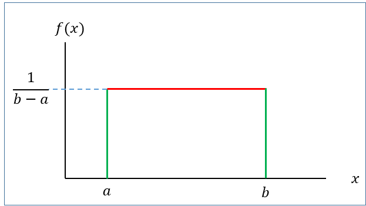
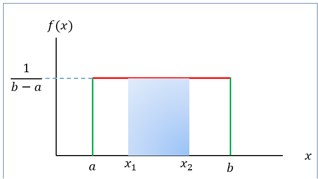
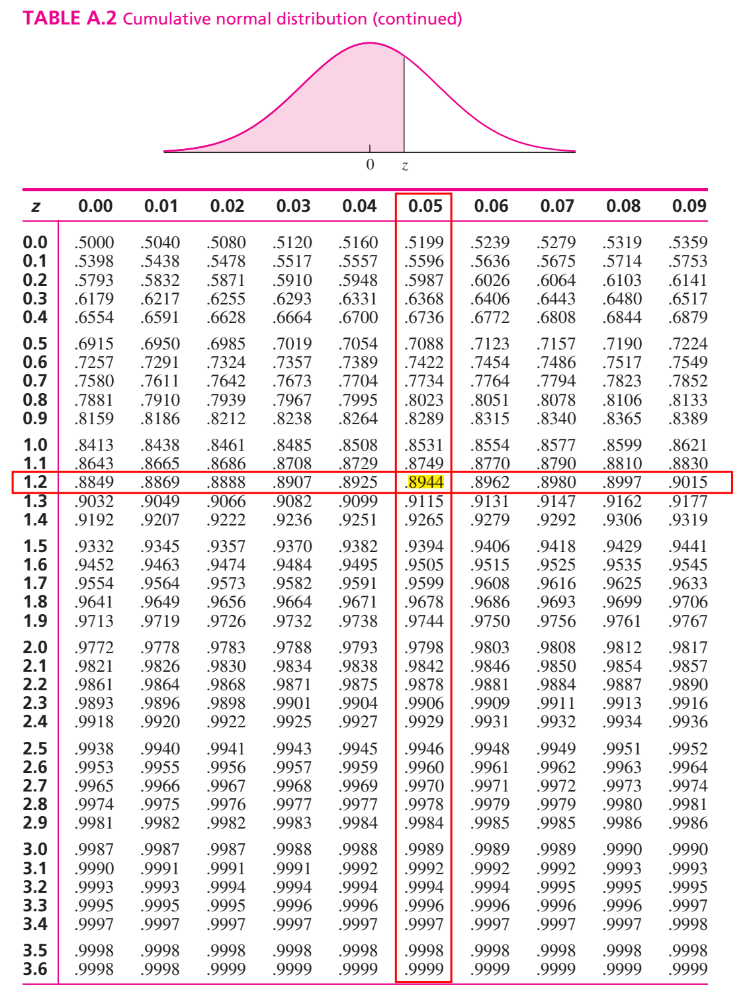
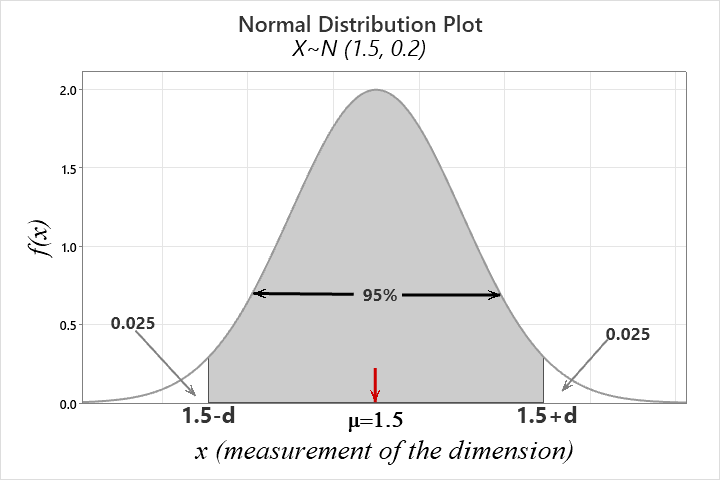

# Continuous r.v and probability density function

## **Definition**

A continuous r.v $X$ must have a probability density function (PDF) $f(x)$ such that

1\) $f(x) \ge 0$ **\[Non-negativity\]**

2\) $\int_{x\in \mathbb{R}} f(x)dx =1$ **\[Total AREA under the curve** $f(x)$ always 1\]

3\) $P(a<X<b)=\int_a^b f(x) dx$

## Illustration with an example

Given $f(x)=\frac{1}{2}x \ \ ; 0\le x\le 2$

a\) Show/plot the graph of $f(x)$.

b\) Is $f(x)$ a PDF?

c\) Find $P(X<1.0)$.

d\) Find $P(X=1.0)$

::: callout-note
We always remember that **Probability in an interval of** $X$ is a**ctually the** $AREA$ **under the pdf** $f(x)$**.**
:::

**Problem 4.1** A random variable has the following density function.

$$f(x)=1-0.5x \ \ ; \ \ 0<x<2$$\
a) Graph the density function.

b\) Verify that $f(x)$ is a density function.

c\) Fond $P(X>1)$.

d\) Find $P(X<0.5)$.

e\) Find $P(X=1.5)$.

**N.B:** $P(X=a)=0$ as well as $P(X=b)=0$. So, $P(X\le a )$ is same as $P(X<a)$.

## **CDF of** continuous r.v $X$

By definition, CDF,

$$F(x)=P(X\le x)= \int_{-\infty}^{x} f(x)dx$$

Therefore,

- $f(x)=\frac{d}{dx} F(x)$.

- $P(a<X<b)=F(b)-F(a)$.

**Problem 4.2** [@walpole2017]Consider the probability density function (PDF):

$$f(x)=k\sqrt x \ \ ; \  \ 0<x<1$$

\(a\) Evaluate $k$.

\(b\) Find $F(x)$ and use it to evaluate $P(0.3<X<0.6)$.

***Solution:***

\(a\) Since $f(x)$ is a PDF so

$$\int_{-\infty}^{+\infty} f(x)dx =1$$

$$\implies \int_{0}^{1} k\sqrt x dx=1$$

$$\implies k \int_{0}^{1} x^{\frac{1}{2}} \  \ dx=1$$

$$\implies k \left [ \frac{x^{\frac{1}{2}+1}}{\frac{1}{2}+1} \right]_{0}^{1}=1$$

$$\implies k \cdot \frac{2}{3} \left [ x^{\frac{3}{2}}    \right]_{0}^{1}=1 $$

$$\implies k\cdot \frac{2}{3} [ 1^{3/2} -0^{3/2}]=1$$

$$\implies k\cdot \frac{2}{3}\cdot 1=1$$

$$\therefore k=\frac{3}{2}$$

So, $f(x)=\frac{3}{2} \sqrt x \  \; \  \ 0<x<1$\
(b) By definition

$$F(x)=P(X\le x) $$

$$=\int_{0}^{x} f(x) \  \ dx=\int_{0}^{x} \frac{3}{2} x^{\frac {1}{2}} dx$$

$$=\frac{3}{2} \left [\frac {x^{\frac{3}{2}} }{\frac{3}{2}}  \right]_{0}^{x}$$

$$= x^{\frac {3}{2}}$$

$$\therefore F(x)=x^{\frac{3}{2}}   \ \ ; \  \ 0<x<1$$

Now,

$$P(0.3<X<0.6)=F(0.6)-F(0.3)=(0.6)^\frac{3}{2}-(0.3)^\frac{3}{2}=0.3005 $$

**Problem 4.3** [@walpole2017] Suppose that the error in the reaction temperature, in $^0C$, for a controlled laboratory experiment is a continuous random variable $X$ having the probability density function :

$$f(x) =\frac{1}{3} x^2 \ \ ;  \ \ -1<x<2$$

\(a\) **Verify** that $f(x)$ is a PDF.

\(b\) **Find** $F(x)$ and then **evaluate** $P(0<X\le 1)$.\

**Solution: *TRY yourself.***

## **Expectation and variance of continuous r.v**

If $X$ is a continuous r.v with PDF $f(x)$ then

Expected value of $X$ is

$$\mu=E(X)= \int_{x\in \mathbb{R}} x\cdot f(x)dx$$ Variance of $X$ is

$$Var(X)=E(X^2)-\mu^2=\int_{x\in \mathbb{R}} x^2\cdot f(x)dx-\mu^2$$

## Uniform distribution

A continuous r.v $X$ is said to be uniform r.v ranges between $a$ to $b$ if it has the following PDF

$$f(x)=\frac{1}{b-a} \ \ ; \ \ a<x<b$$ {#eq-unif.pdf}

{#fig-unifpdf width="377"}

with

**Mean:** $\mu=E(X)=\frac{a+b}{2}$

**Variance:** $\sigma^2=\frac{(b-a)^2}{12}$

[**We write,**]{.underline} $X\sim U(a,b)$

### Finding probability for uniform r.v

If $X\sim U(a,b)$ then the $P(x_1<X<x_2)$ is actually the **area of the shaded rectangle.**

{width="380"}

That is,

$$P(x_1<X<x_2)=Base\times Height=(x_2-x_1)\times \frac{1}{b-a}$$

**Problem 4.4** When a motorist stops at a red light at a certain intersection, the waiting time for the light to turn green, in seconds, is uniformly distributed on the interval (0, 30).

(a) Find the probability that the waiting time is between 10 and 15 seconds.

(b) Find the mean and variance of the waiting time.

## Normal or Gaussian r.v

The most important probability distribution for describing a continuous random variable is the **normal probability distribution**. The normal distribution has been used in a wide variety of practical applications in which the random variables are heights and weights of people, test scores, scientific measurements, amounts of rainfall, and other similar values.

### Definition

A continuous r.v $X$ is said to be normal r.v if it has the following **PDF:**

$$f(x)=\frac{1}{\sigma \sqrt{2\pi}} e^{-\frac{1}{2} (\frac{x-\mu}{\sigma})^2}\ \ ; -\infty<x<\infty$$ {#eq-normal}

The graph of $f(x)$ is called **normal curve** (@fig-normalpdf)**.**

```{r fig.height=2.5, fig.width=5}
#| label: fig-normalpdf
#| fig-cap: "Normal Curve"
#| fig-align: left

library(tidyverse)

# Create a sequence of x values
x <- seq(10, 30, length = 100)

# Calculate the y values for the normal distribution
y <- dnorm(x,20,3)

# Create a data frame
data <- data.frame(x, y)


ggplot(data, aes(x = x, y = y)) +
  geom_line(color = "blue",lwd=1) +
  labs(title = " ", 
  x=expression(mu), y = "f(x)")+
  geom_vline(xintercept=20)+
  theme_classic()+
  theme(axis.text=element_blank(),
        axis.title = element_text(size = 14),
        plot.title = element_text(hjust = 0.5)
        )->normal.curve
normal.curve  
```

**Mean:** $E(X)=\mu$

**Variance:** $Var(X)=\sigma^2$

[**We write:**]{.underline} $X\sim N(\mu , \sigma^2)$

**Properties of normal distribution**

- The **total area** under the normal curve $f(x)$ is 1 that is

  $$\int_{-\infty}^{\infty} f(x)dx=1$$

- Normal distribution is symmetric about mean, $\mu$

- Mean, median and mode is identical in normal distribution that is $Mean=Median=Mode=\mu$

- Almost $99\%$ observations of $X$ lie within **3 standard deviation of mean** that is

  $$P(\mu-3\sigma<X<\mu+3\sigma)\approx 0.99$$

- Almost $95\%$ observations of $X$ lie within **2 standard deviation of mean** that is $$P(\mu-2\sigma<X<\mu+2\sigma)\approx 0.95$$

- Almost $68\%$ observations of $X$ lie within **1 standard deviation of mean** that is $$P(\mu-\sigma<X<\mu+\sigma)\approx 0.68$$

### Standard normal r.v

Suppose $X\sim N(\mu, \sigma^2)$. Then the variable $Z=\frac{X-\mu}{\sigma}$ is said to be **standard normal variable** with **PDF**

$$f(z)=\frac{1}{\sqrt {2\pi}} e^{-\frac{1}{2}z^2} \ \ ; -\infty<z<\infty$$ {#eq-standardnorm}

**Mean:** $E(Z)=0$

**Variance:** $Var(Z)=1$

[**We write:**]{.underline} $Z\sim N(0,1)$

```{r fig.height=2.5, fig.width=5}
#| label: fig-zcurve
#| fig-align: left
#| fig-cap: "Standard normal curve"

par(mar = c(3.77, 3.77, 1, 1))

fz=function(x) {(1/sqrt(2*pi))*exp(-x^2)}

curve(fz,from = -3.2, to = 3.2,
      xlab = "z",ylab = "f(z)",lwd=2)

abline(v = 0, col = "red", lwd = 2)


```

### Computing probability(area) under standard normal curve

To compute area (probability) under the standard normal curve for a given interval of $z$ we use **standard Normal Distribution** **table** which provides cumulative probabilities.

**RULE-I:** Suppose we want to find $P(Z<1.25)$.

From **TABLE A.2** in @navidi2011 we have

$$P(Z<1.25)=0.8944$$

\
The probability $P(Z<1.25)$ is shown in @fig-areaz.

```{r fig.height=2.5, fig.width=5}
#| label: fig-areaz
#| fig-cap: "Area under standard normal curve for Z<1.25"
#| fig-align: left

# Load ggplot2 package
library(ggplot2)

# Define the mean and standard deviation
mean <- 0
sd <- 1

# Define the shading bounds for the central 95% interval
lower <- -1.96  # Lower bound (e.g., -1.96 for 95% CI)
upper <- 1.96   # Upper bound (e.g., 1.96 for 95% CI)

# Create a data frame to specify the x range
x_range <- data.frame(x = c(-4, 4))

# Create the plot
ggplot(x_range, aes(x)) +
  scale_x_continuous(breaks = seq(-4,4,1)) +
  # Plot the normal distribution curve
  stat_function(fun = dnorm, args = list(mean = mean, sd = sd)) +
  
  # Shade the area under the curve between the lower and upper bounds
  stat_function(fun = dnorm, args = list(mean = mean, sd = sd), geom = "area", 
                xlim = c(-4, 1.25), fill = "skyblue", alpha = 0.5) +
  
  # Labels and theme
  labs(x = "z", y = "f(z)", title = "") +
  theme_classic()+
  annotate("text",x=0,y=0.15,label="P(Z<1.25)=0.8944")

```

**RULE-II:** Now we find $P(Z>1.36)$

So, due to symmetry we can write $P(Z>1.36)=P(Z<-1.36)=0.0869$\

```{r fig.height=2.5, fig.width=5}
#| label: fig-areaz2
#| fig-cap: "Area under standard normal curve for Z>1.36"
#| fig-align: left

# Create the plot
ggplot(x_range, aes(x)) +
  scale_x_continuous(breaks = seq(-4,4,1)) +
  # Plot the normal distribution curve
  stat_function(fun = dnorm, args = list(mean = 0, sd = 1)) +
  
  # Shade the area under the curve between the lower and upper bounds
  stat_function(fun = dnorm, args = list(mean = mean, sd = sd), geom = "area", xlim = c(1.36, 4), fill = "skyblue", alpha = 0.5) +
  
  # Labels and theme
  labs(x = "z", y = "f(z)", title = "") +
  theme_classic()+
  annotate("text",x=3,y=0.1,label="P(Z>1.36)=0.0869")
```

**RULE-III:** Let us evaluate $P(-1.96<Z<2.58)$.

We can write

$$=P(-1.96<Z<2.58)$$

$$=P(Z<2.58)-P(Z<-1.96)$$

$$=0.9951-0.0250=0.9701$$

```{r fig.height=2.5, fig.width=5}
#| label: fig-areaz3
#| fig-cap: "Area under standard normal curve for -1.96<Z<2.58"
#| fig-align: left

# Create the plot
ggplot(x_range, aes(x)) +
  scale_x_continuous(breaks = seq(-4,4,1)) +
  # Plot the normal distribution curve
  stat_function(fun = dnorm, args = list(mean = 0, sd = 1)) +
  
  # Shade the area under the curve between the lower and upper bounds
  stat_function(fun = dnorm, args = list(mean = mean, sd = sd), geom = "area", xlim = c(-1.96, 2.58), fill = "skyblue", alpha = 0.5) +
  
  # Labels and theme
  labs(x = "z", y = "f(z)", title = "") +
  theme_classic()+
  annotate("text",x=-.02,y=.1,label="P(-1.96<Z<2.58)=0.9701")
```

### Finding quantiles (percentiles, quartiles, deciles etc.) of $Z$

What is the $90^{th}$ percentile of $Z$? To answer this question, let $k$ is the $90^{th}$ percentile of $Z$. So we can write

$$P(Z<k)=0.90 \ \  \ \ \ \ \ \ \ \cdot \cdot \cdot (1)$$

From **TABLE A.2** in @navidi2011 we have

$$P(Z<1.28)=0.90 \ \  \ \ \ \ \ \ \ \cdot \cdot \cdot(2)$$

Comparing eq.(1) with eq.(2) we have $k=1.28$. So the $90^{th}$ percentile of $Z$ is $1.28$.

**Problem 1** Find $c$ such that $P(Z>c)=0.05$.

**Problem 2** Find $c$ such that $P(-c<Z<c)=0.95$.

### Computing probability(area) under normal curve:

**Problem 4.5** Suppose $X\sim N(30, 5^2)$ . Then find the following:

a\) $P(X<22)$

b\) $P(X>44)$

c\) $P(20<X<35)$

d\) If $P(X<x)=0.25$ then find the value of $x$.

***Solution:***

Here, $\mu=30$ and $\sigma=5$

------------------------------------------------------------------------

a\) $P(X<22)=P(\frac{X-\mu}{\sigma}<\frac{22-30}{5})=P(Z<-1.60)=0.0548$.

------------------------------------------------------------------------

b\) $P(X>44)=P(\frac{X-\mu}{\sigma}>\frac{44-30}{5})$

$=P(Z>2.80)=P(Z<-2.80)=0.0026$

------------------------------------------------------------------------

c\) $P(20<X<35)=P(\frac{20-30}{5}<\frac{X-\mu}{\sigma}<\frac{35-30}{5})$

$=P(-2<Z<1)=P(Z<1)-P(Z<-2)$

$=0.8413-0.0228=0.8185$

------------------------------------------------------------------------

d\) To find the value of $x$ we proceed this way.

$$P(X<x)=0.25$$

$$\implies P(\frac{X-\mu}{\sigma}<\frac{x-30}{5})=0.25$$

$$\implies P(Z<\frac{x-30}{5})=0.25 \ \ \ \ \ \cdot \cdot \cdot (1)$$

From TABLE (Appendix B) we have

$$P(Z<-0.67)=0.25  \ \ \ \ \cdot \cdot \cdot (2)$$

Comparing (1) with (2) we can write

$$\frac{x-30}{5}=-0.67$$

$$\implies x=30+(-0.67)\times 5$$

$$\therefore x=26.65$$

::: callout-note
If $P(X<x)=p$ and

$P(Z<z)=p$ then

$$x=\mu+z\sigma$$
:::

### Applications of the Normal Distribution [@walpole2017]

**Example 6.7**: A certain type of storage battery lasts, on average, 3.0 years with a standard deviation of 0.5 year. Assuming that battery life is normally distributed, find the probability that a given battery will last less than 2.3 years.

**Example 6.8** : An electrical firm manufactures light bulbs that have a life, before burn-out, that is normally distributed with mean equal to 800 hours and a standard deviation of 40 hours. Find the probability that a bulb burns between 778 and 834 hours.

**\*Example 6.9** : In an industrial process, the diameter of a ball bearing is an important measurement. The buyer sets specifications for the diameter to be $3.0 \pm 0.01$ cm. The implication is that no part falling outside these specifications will be accepted. It is known that in the process the diameter of a ball bearing has a normal distribution with mean $\mu = 3.0$ and standard deviation $\sigma = 0.005$. On average, how many manufactured ball bearings will be scrapped?

**Example 6.10** : Gauges are used to reject all components for which a certain dimension is not within the specification $1.50 \pm d$. It is known that this measurement is normally distributed with a mean of 1.50 and a standard deviation of 0.2. Determine the value d such that the specifications "cover" 95% of the measurements.

**Solution:**

Let, $X=measurement \ \ of \ \ certain \ \ dimension$

Given, $X\sim N(1.5,0.2)$

According to question,

$P(1.5-d<X<1.5+d)=0.95$

So, $P(X<1.5-d)+P(X>1.5+d)=0.05$

{width="404" height="239"}

So, $P(X <1.5-d)=0.025  \ \ \ \ \cdot \cdot \cdot(1)$

$\implies P(\frac{X-\mu}{\sigma} <\frac{1.5-d-1.5}{0.2})=0.025$

$\implies P(Z<\frac{-d}{0.2})=0.025 \ \ \ \ \cdot \cdot \cdot(1)$

From TABLE A.2 we have

$P(Z<-1.96)=0.025 \ \ \ \ \ \cdot \cdot\cdot(2)$

Comparing eq.(1) with eq. (2) we have

$\frac{-d}{0.2}=-1.96$

$\implies -d=-0.392$

$\therefore d=0.392$

**Alternative:**

$P(X <1.5-d)=0.025  \ \ \ \ \cdot \cdot \cdot(1)$

But, $P(Z<-1.96)=0.025 \ \ \ \ \cdot \cdot \cdot (2)$

Hence, $1.5-d=\mu+z\sigma$; where $z=-1.96$

$\implies 1.5-d=1.5-1.96\times 0.2$

$\therefore d=0.392$

**\*Exercise 6.11** : A soft-drink machine is regulated so that it discharges an average of 200 milliliters per cup. If the amount of drink is normally distributed with a standard deviation equal to 15 milliliters,

(a) what fraction of the cups will contain more than 224 milliliters?
(b) what is the probability that a cup contains between 191 and 209 milliliters?
(c) how many cups will probably overflow if 230-milliliter cups are used for the next 1000 drinks?
(d) below what value do we get the smallest 25% of the drinks?

**\*Exercise 6.14** The finished inside diameter of a piston ring is normally distributed with a mean of 10 centimeters and a standard deviation of 0.03 centimeter.

(a) What proportion of rings will have inside diameters exceeding 10.075 centimeters?
(b) What is the probability that a piston ring will have an inside diameter between 9.97 and 10.03 centimeters?
(c) Below what value of inside diameter will 15% of the piston rings fall?

**Exercise 6.17** : The average life of a certain type of small motor is 10 years with a standard deviation of 2 years. The manufacturer replaces free all motors that fail while under guarantee. If she is willing to replace only 3% of the motors that fail, how long a guarantee should be offered? Assume that the lifetime of a motor follows a normal distribution.

## Some important derived continuous distribution

### Chi-square ($\chi^2$) distribution

The continuous random variable X has a chi-squared distribution, with $\nu$ degrees of freedom, if its density function is given by $$f(x)=\frac{1}{2^{\nu/2}\Gamma (\nu /2)}x^{\nu/2 -1}e^{-x/2}\ \ ; \ \ x>0$$

Where $\nu$ is a positive integer.

The mean and variance of the chi-squared distribution are $$\mu=\nu \ \ \mathrm{and}\ \  \sigma^2=2\nu$$

### $t$-distribution

### $F$- distribution
